# ubuntu-intune
## intune-portal installation
to initially install intune-portal, run: 

`wget https://raw.githubusercontent.com/sebstec/ubuntu-intune/refs/heads/master/install.sh && chmod 755 ./install.sh && ./install.sh`

and then reboot your system

this will clone the repository to your pwd and install intune-portal

### note: do not login to intune yet

## intune-configuration
log into intune portal as an admin: `intune.microsoft.com`

go to devices => linux:

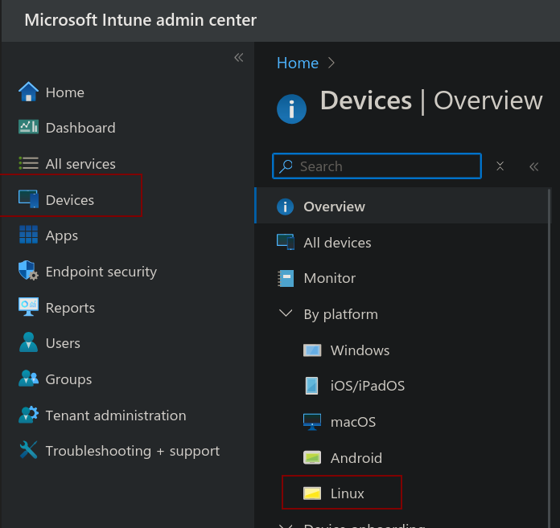

go to scripts => add:

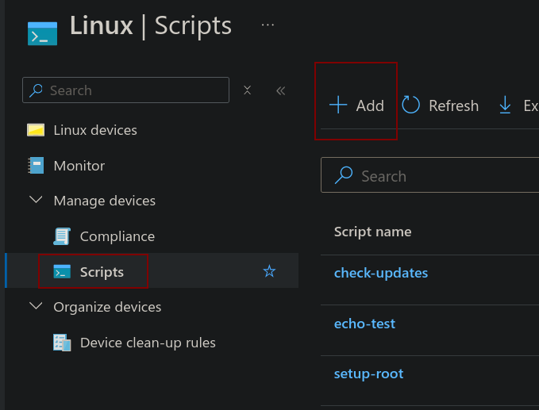

add all scripts from app-scripts/ (excluding the user-mode/ and windows/ directories and content), like so:

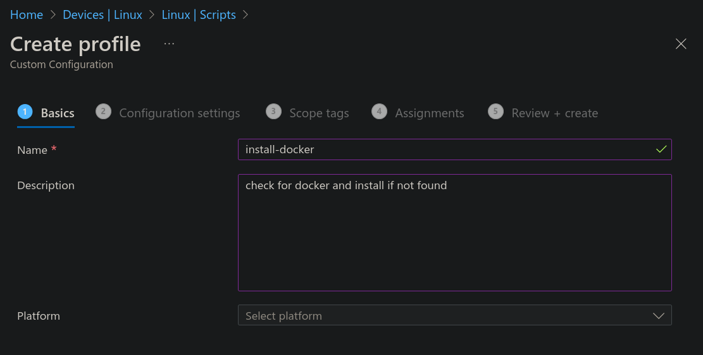

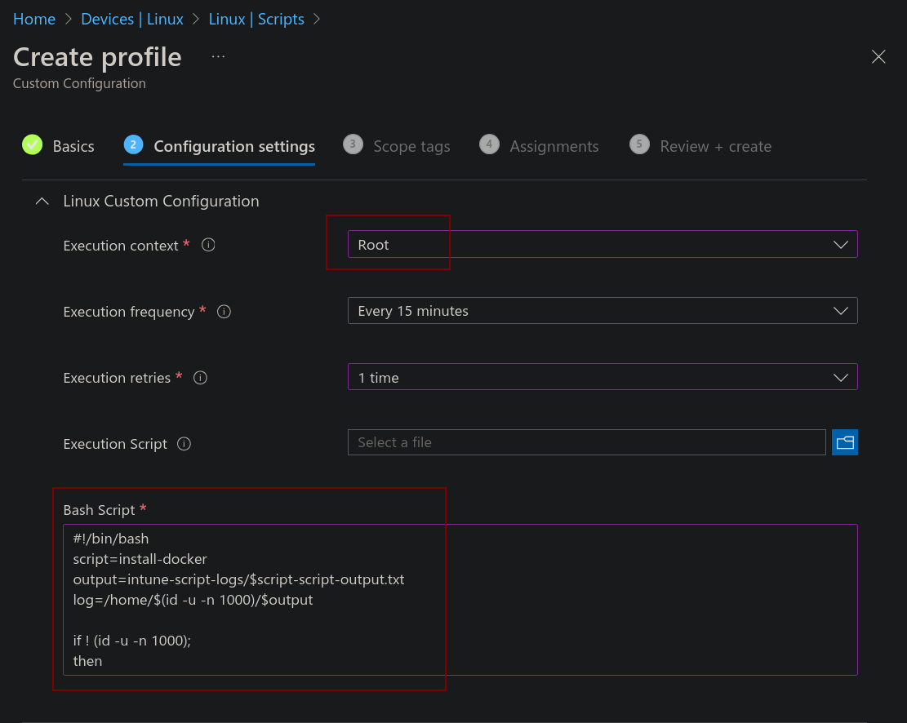

dont forget to assign to a group:

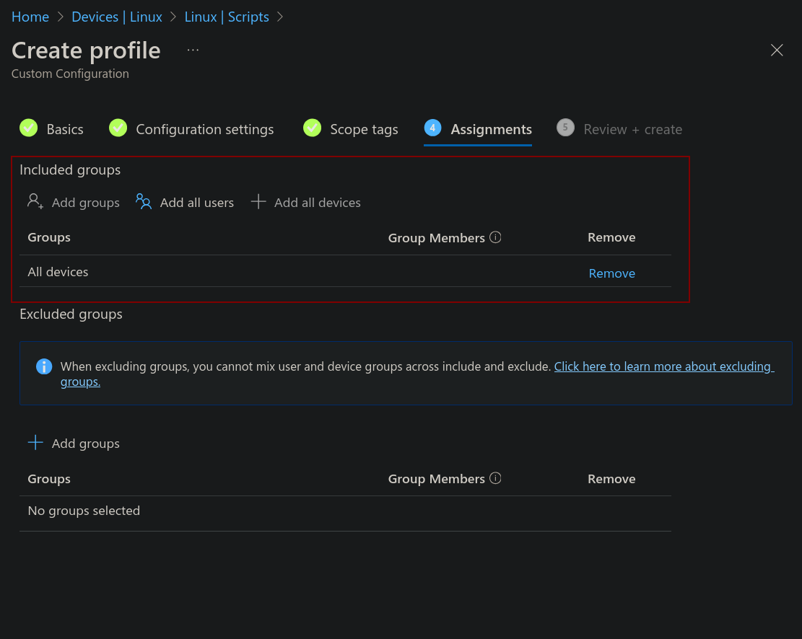

### note: you might want to skip the config-scripts directory, it is unsafe ;)

## setup compliance policies and conditional access if you desire
see: `https://github.com/microsoft/shell-intune-samples/tree/master/Linux`

### note
- it can take a while until newly created user can be used to login to intune-portal
- if conditional access is used:
    - intune portal must be excluded to sync settings with intune and check for compliance
    - for the initial call-in by intune portal, some more endpoints must be excluded (TODO: find out what that is - i just disabled conditional access for linux devices to do the setup but that might not be possible)

## mde (ms defender for endpoint) 
mde requires some more configuration:
### downloading the configuration package
step 1: log into the microsoft defender portal as an admin: `security.microsoft.com`

step 2: go to settings => endpoints

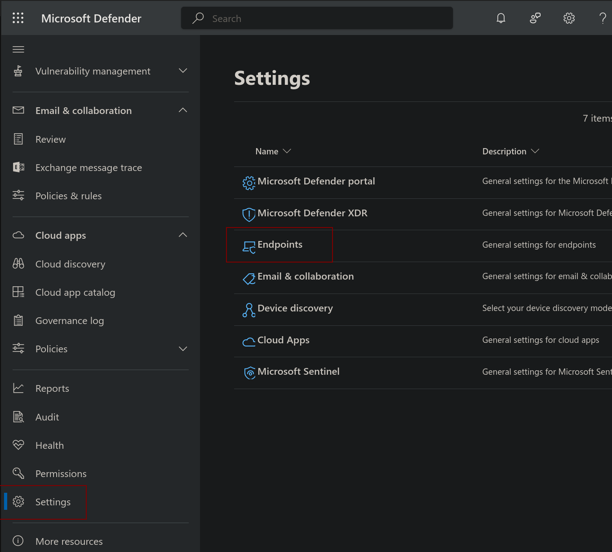

step 3: download onboarding package:

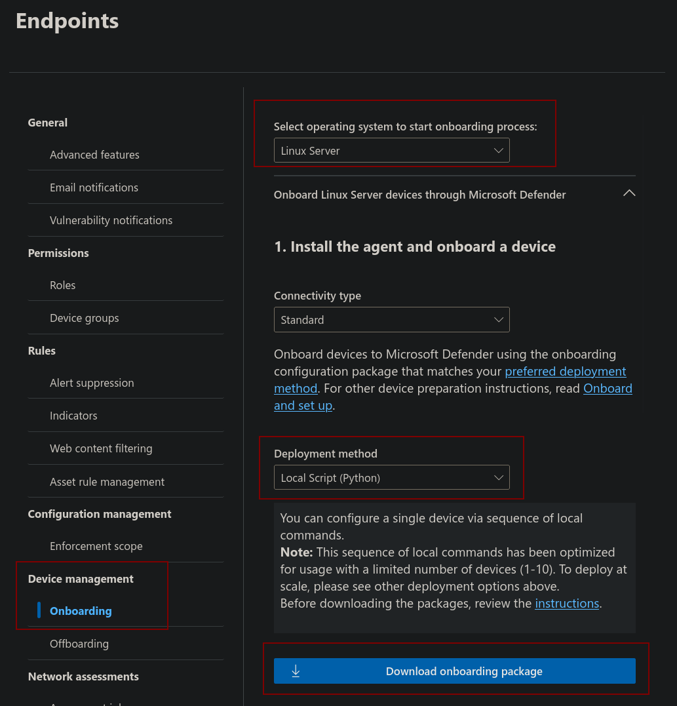

### preparing mde installation
step 4: unzip this package and put it into the /home/YOUR-USER/mde directory:

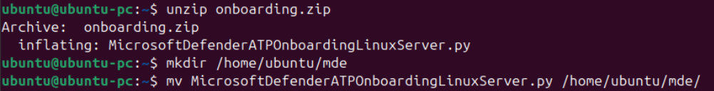

for reference:
`https://github.com/microsoft/mdatp-xplat/blob/master/linux/installation/README.md`

## intune-portal-login

### installation of mandatory apps and configurations
start intune-portal and login with your microsoft account:

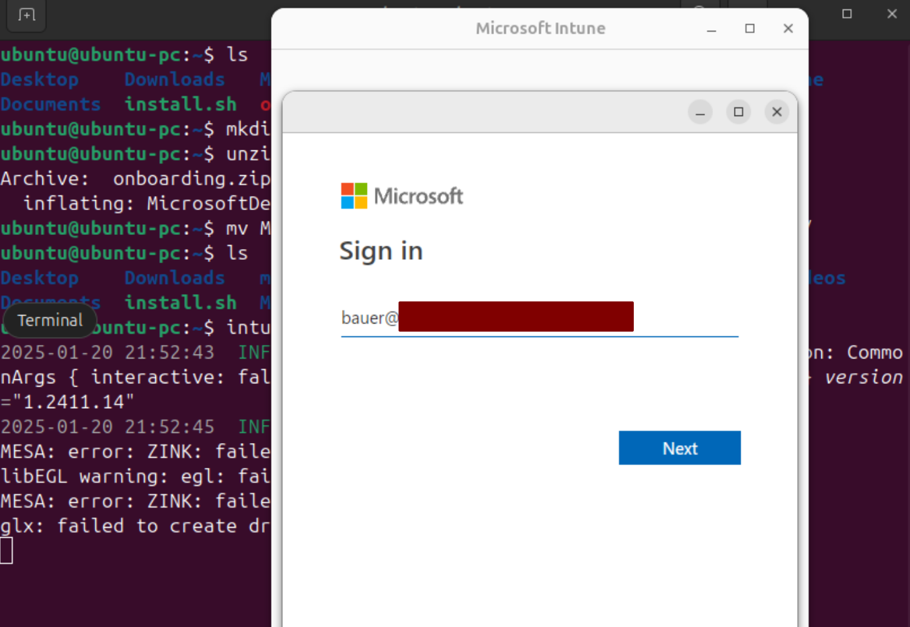

you will be prompted to register the device after a successful login:

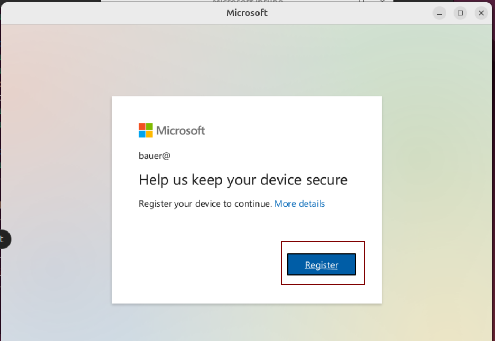

begin enrolling:

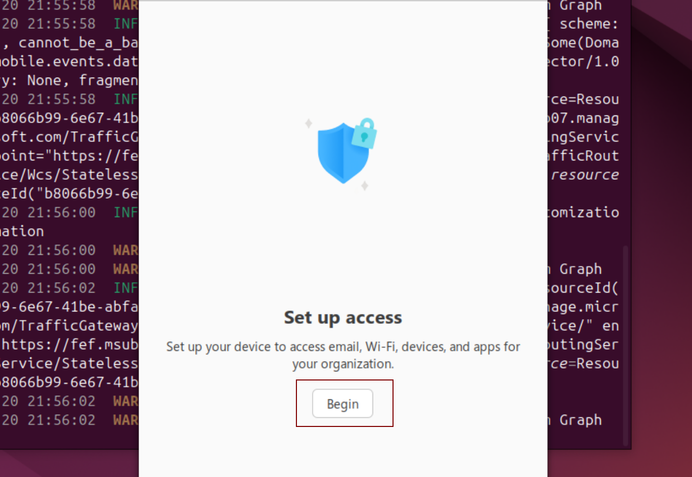

you must allow data collection by ms:

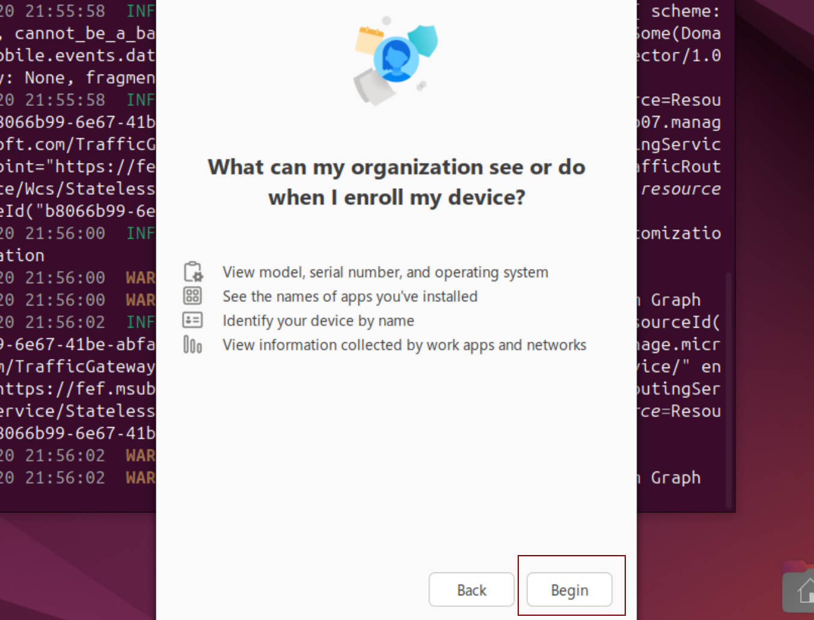

afterwards the device is being enrolled:

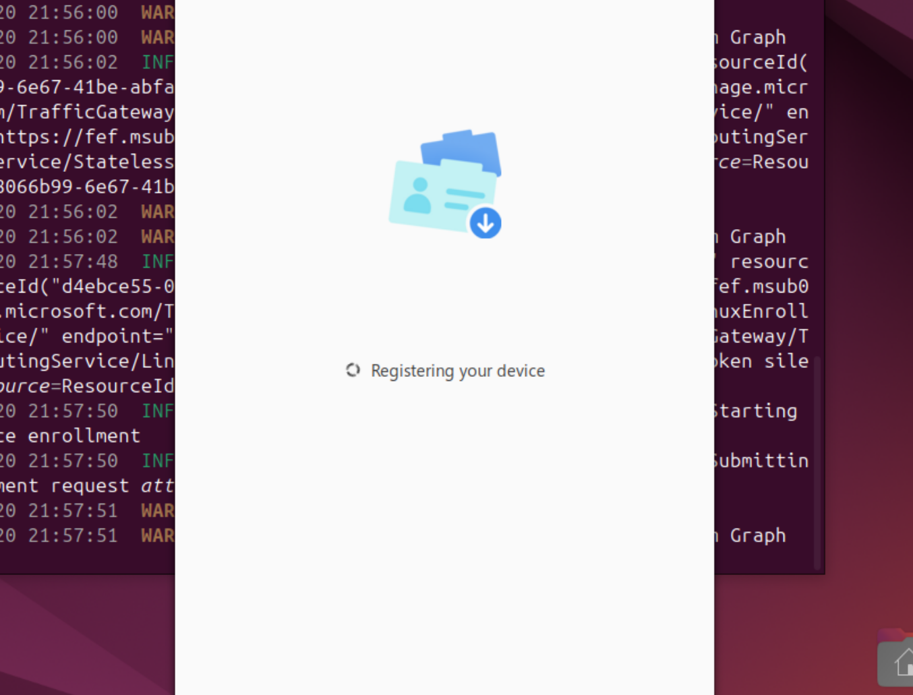

finally, you need to give root access to intune in order to run configurations as root:

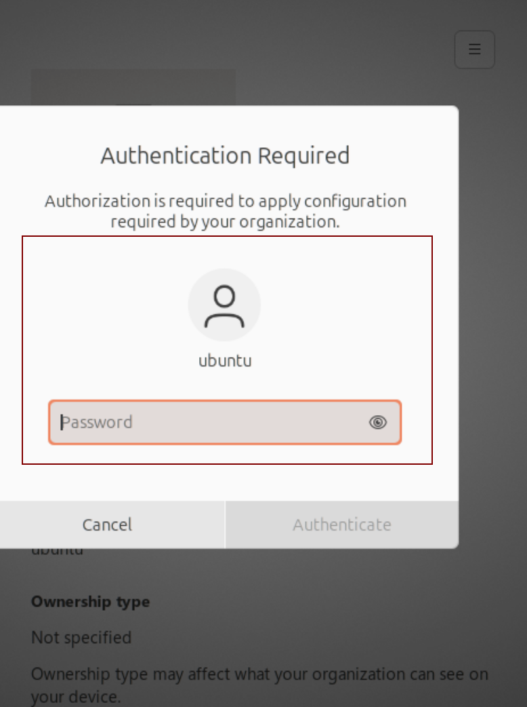

now intune is synchronizing the given configurations:

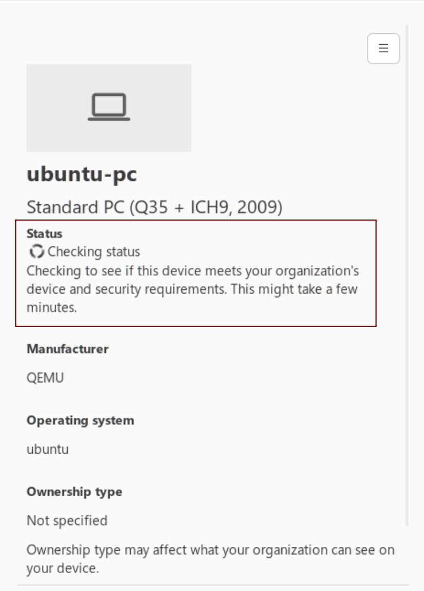

once the sync is complete, you should have all configured apps installed

### triggering installation a second time in case something breaks on first try
wait 15min then open intune-portal and trigger a checking:

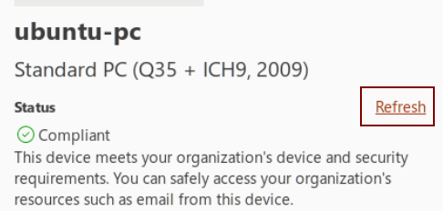

## seamless rdp
### get windows in docker
step 1: cd to ubuntu-intune/app-scripts/windows

step 2: run `docker compose up`

step 3: wait until the cli says something about connecting via web browser

step 4: connect via web browser and check installation progress

step 5: once installation finished, continue to next section

### implement windows gui apps via rdp (or just connect to the whole windows desktop)
replace USER, PASSWORD and IP in following prompt

`xfreerdp /cert:tofu /sound /microphone /d: /u:USER /p:PASSWORD /scale:100 +dynamic-resolution +auto-reconnect +home-drive +clipboard -wallpaper '/app:program:C:\Windows\explorer.exe,name:Microsoft Explorer' /v:IP
`

like that:

`xfreerdp3 /cert:tofu /sound /microphone /d: /u:bill /p:gates /scale:100 +dynamic-resolution +auto-reconnect +home-drive +clipboard -wallpaper '/app:program:C:\Windows\explorer.exe,name:Microsoft Explorer' /v:127.0.0.1`

and enjoy integration via rdp (some windows settings might be necessary - see files in app-scripts/windows/oem)

for full windows:

`xfreerdp3 /cert:tofu /sound /microphone /d: /u:bill /p:gates /scale:100 +dynamic-resolution +auto-reconnect +home-drive +clipboard -wallpaper /v:127.0.0.1`

### note: if the home drive is already mounted via docker/qemu or some other way, the home-drive sharing via rdp is probably not necessary

## bonus apps:
check app-scripts/user-mode for install scripts in user context
